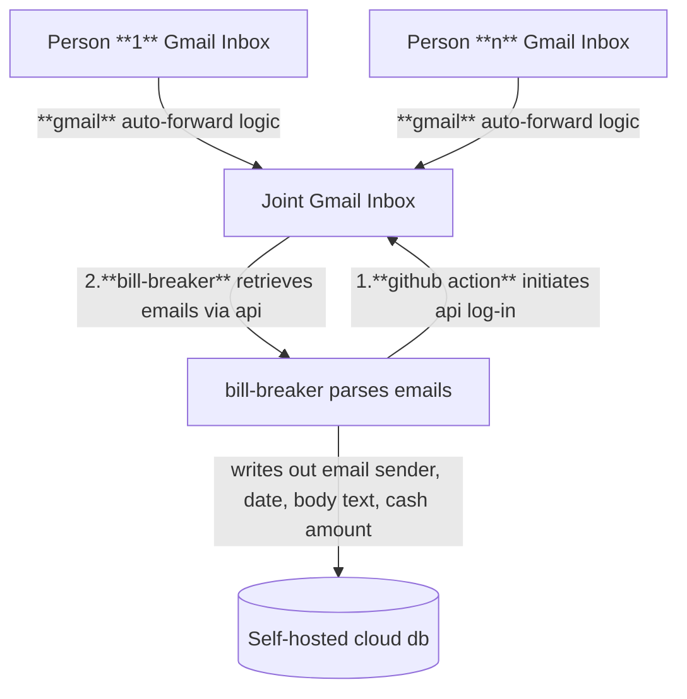

# Gmail Bill Splitter

## Current structure
A Python application that:  
- Logs into Gmail using OAuth 2.0  
- Retrieves credit card bill emails from your inbox  

### Next Steps:
- Generates a monthly expense spreadsheet  
- Splits costs between people  
- Sends each person their cost breakdown via email

## Google API Setup

1. Go to [Google Cloud Console](https://console.cloud.google.com/).  
2. Create a new project called `bill-splitter`.  
3. **Enable Gmail API:**  
   - Navigate to **APIs & Services → Library**  
   - Search for **Gmail API**  
   - Click **Enable**  
4. **Configure OAuth consent screen:**  
   - Go to **APIs & Services → OAuth consent screen**  
   - Choose **External** (unless you’re in a G Suite domain)  
   - Add your Gmail account as a **test user**  
   - Fill in the required fields (app name, email)  
5. **Create OAuth credentials:**  
   - Go to **APIs & Services → Credentials → Create Credentials → OAuth Client ID**  
   - App type: **Desktop app**  
   - Download the file as `credentials.json`  
   - Save it in your project root (same folder as `main.py`)  